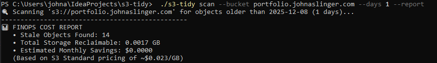

# s3-tidy: Cloud Storage Governance Tool


**A high-performance CLI utility for enforcing retention policies and auditing cloud storage costs.**

## 🛑 The Problem
In distributed microservices architectures (like my EKS cluster), ephemeral artifacts—logs, temporary backups, and CI test results—often accumulate in S3. These "zombie objects" silently drive up storage costs and create security/compliance risks.

Managing this via Lifecycle Rules is often too coarse-grained, and Python scripts are slow and difficult to distribute to engineering teams.

## ⚡ The Solution
`s3-tidy` is a dependency-free binary written in **Go (Golang)**. It allows Platform Engineering teams to:
1.  **Audit Costs:** Instantly estimate potential savings from stale objects.
2.  **Enforce Hygiene:** Clean up buckets based on granular age thresholds.
3.  **CI/CD Ready:** Runs safely in pipelines with dry-run protection.

## 📸 FinOps Reporting Capability
Unlike standard cleanup scripts, `s3-tidy` includes a **Cost Estimation Engine** that calculates reclaimable storage value before taking action.


*(Above: The tool identifying cost savings in a production bucket)*

## 🚀 Installation

```bash
# Clone and build locally
git clone [https://github.com/johnaslinger/s3-tidy.git](https://github.com/johnaslinger/s3-tidy.git)
cd s3-tidy
go build -o s3-tidy main.go

# Verify installation
./s3-tidy --help
````

## 🛠️ Usage

### 1\. Audit Mode (Safe)

Generate a cost report without deleting any data. Useful for weekly governance reviews.

```bash
./s3-tidy scan --bucket my-app-logs --days 30 --report
```

### 2\. Dry Run

Preview exactly which files would be deleted.

```bash
./s3-tidy scan --bucket my-app-logs --days 30 --dry-run=true
```

### 3\. Execution (Pipeline Mode)

Execute the cleanup.

```bash
./s3-tidy scan --bucket my-app-logs --days 30 --dry-run=false
```

## 🏗️ Architecture Decisions

### Why Go?

* **Concurrency:** Leverages Go goroutines to scan large buckets (10k+ objects) significantly faster than interpreted languages.
* **Portability:** Compiles to a single static binary. No need to `pip install` dependencies in CI runners.
* **Type Safety:** Prevents runtime errors common in loosely typed cleanup scripts.

### why AWS SDK v2?

* Built using the modern `aws-sdk-go-v2` for modularity and performance.
* Respects standard `~/.aws/config` chains for seamless local execution.

-----

*Maintained by John Aslinger*

```